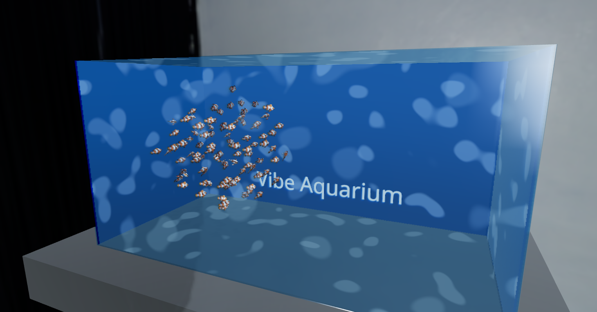

# Vibe Aquarium Sim

A relaxing, physics-driven aquarium simulation built with React, Three.js and Rapier physics — designed as a high-performance, ECS-driven interactive demo.

Models were generated with experimental Copilot 3D:
(https://copilot.microsoft.com/labs/experiments/3d-generations)

Live demo: [deadronos.github.io/vibe-aquarium-sim](https://deadronos.github.io/vibe-aquarium-sim/)
Image: 

Key ideas:

- Physics is the source of truth — rigid bodies in Rapier govern movement and collisions.
- ECS architecture (Miniplex) separates simulation logic (systems) from render/physics representations (components).
- Vite + React (R3F) + TypeScript for fast iteration and strong developer ergonomics.

Tech stack

- React 19 + TypeScript
- Vite (build tooling)
- Three.js + @react-three/fiber for rendering
- @react-three/rapier (Rapier) for physics
- miniplex + miniplex-react for ECS

Repository layout (high-level)

- src/
  - components/: R3F components + physics wrappers (Fish, Tank, Water)
  - systems/: ECS systems (Boids, WaterResistance, Scheduler)
  - store.ts: ECS world and entity definitions
  - shaders/: custom water shader
  - config/: shared physics configuration

- public/: static assets
- tests/: unit / integration tests

Getting started

Prerequisites

- Node.js 20+ (this project uses modern toolchains)

Install

```bash
npm ci
```

Run locally

```bash
npm run dev
```

Build

```bash
npm run build
```

Preview production build

```bash
npm run preview
```

Tests & formatting

```bash
npm run test        # run tests
npm run lint        # ESLint
npm run format      # Prettier
```

Development notes & patterns

- Performance: avoid allocating new Vector3/Matrix objects inside render loops. Look for module-level temporary vectors in systems and components.
- Physics-driven movement: systems compute desired velocities/impulses, apply them to Rapier rigid bodies, and `Fish.tsx` syncs back Rapier state into ECS.
- Query ECS with `world.with(...)` and keep systems focused and fast.

Important files / starting points

- `src/store.ts` — ECS world + entity types
- `src/components/Fish.tsx` — R3F + Rapier integration and ECS sync
- `src/systems/BoidsSystem.tsx` — swarm-like behavior logic
- `src/systems/WaterResistanceSystem.tsx` — simple fluid drag forces
- `src/utils/FixedStepScheduler.ts` — fixed-step simulation helper

GitHub Actions / Deployment

- Pages workflow: `.github/workflows/deploy-pages.yml` builds the app and deploys the `dist/` output to GitHub Pages using current action versions (checkout@v6, setup-node@v6, upload-pages-artifact@v4, deploy-pages@v4).
- Vite `base`: this repo is configured for the project Pages URL `https://deadronos.github.io/vibe-aquarium-sim/` — `base` is set to `/vibe-aquarium-sim/` in `vite.config.ts` and CI passes `--base /vibe-aquarium-sim/` when building.

Contributing

- Read .github/instructions/\* and memory/ to get the project's conventions and design history.
- Keep changes small, test-driven and avoid allocations in render loops.

License & attribution

- Check the repository root for license and contributor information.

Questions / next steps

- Want a PR preview workflow (deploy a preview for PRs) or CI optimization (caching and faster builds)? Open an issue or start a draft PR.
