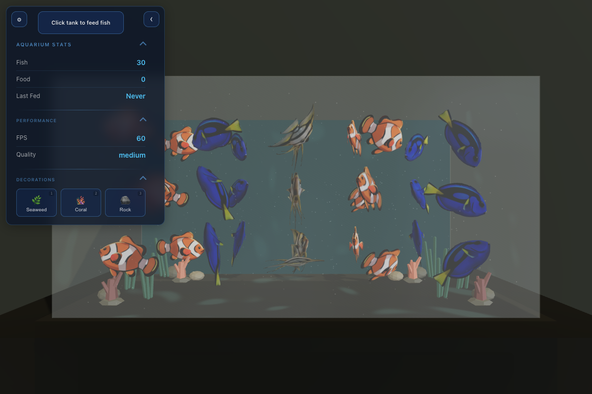
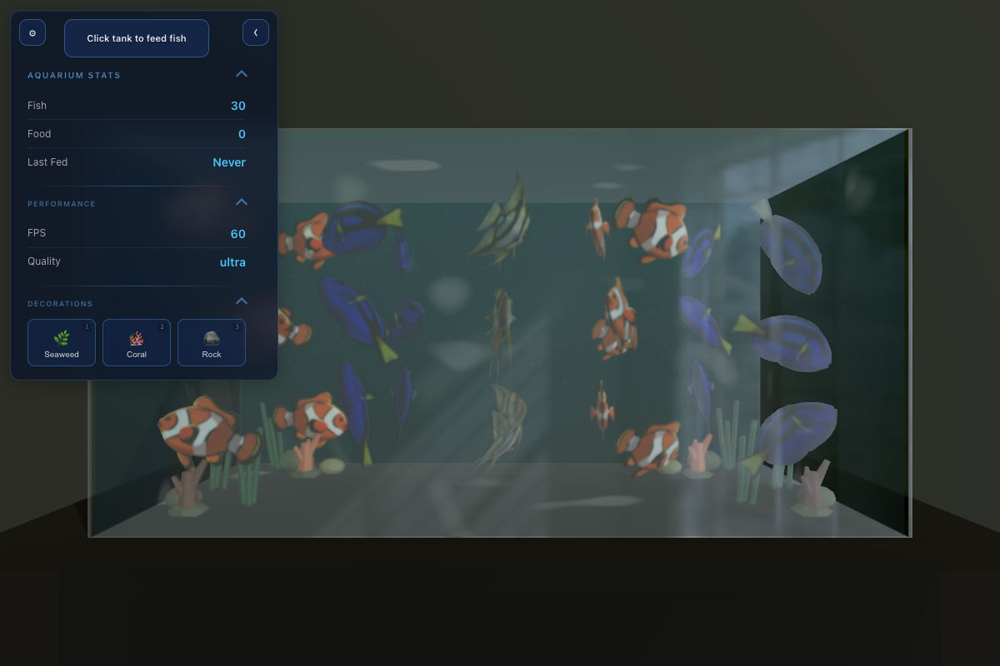
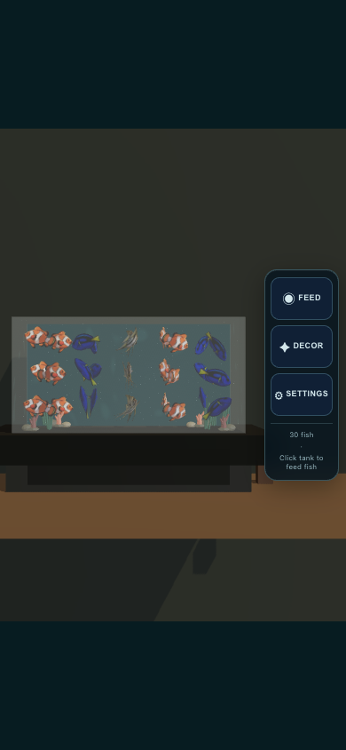
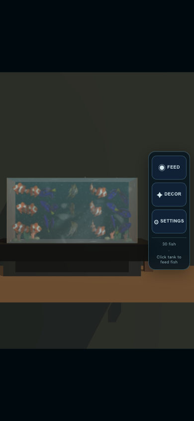

# Issue 146: PR 159 review corrections

## Reproduction and fixes

- **Rear caustics:** the opaque backing was at `z=-0.9934`, ahead of the rear overlay at `z=-0.997`. The overlay now derives its position from the backing plus a small visible-side inset. A component test checks the real mesh vertices with depth testing retained.
- **Stress school:** the old 300-fish layout repeated 60 positions after index 239. A three-dimensional grid now scales with the initial school size. Pairwise tests for 1, 30, and 300 fish assert deterministic, in-bounds positions separated by more than the 0.12 collider diameter. Dynamic add-fish behavior is unchanged.
- **Phone framing:** camera fitting accounts for the whole tank and reserves space for the right action rail. Resize scales the current orbit distance around the controls target, preserving user zoom and pan. Tests project every tank corner at desktop, phone, narrow phone, and landscape sizes, plus a zoomed portrait/landscape round trip.
- **WebGPU clarity:** real screenshots exposed blurred/refracted fish with optical glass thickness 0.9 versus a modeled wall thickness of 0.012. Transmission now uses the modeled thickness and roughness 0.03; the non-transmissive material retains its existing roughness. A component test protects these values.

## Browser verification

`tests/e2e/visual-quality.spec.ts` exercises all eight combinations of WebGL/WebGPU and low/medium/high/ultra. Every case requires the requested backend without fallback, all three fish models ready, 30 rendered fish, and subsequent animation frames before capture. It captures both 1200×800 and 390×844 viewports and checks the requested quality remains active, with no page/console errors or HTTP error responses.

Explicit `?quality=low|medium|high|ultra` now locks the selected preset. Normal visits continue to adapt automatically. Use the same query, viewport, initial composition, and readiness conditions for comparisons; this is a human-review artifact suite, not a claim of pixel-identical live physics or shader animation.

```sh
npm run build
npx playwright test --workers=1
```

CI runs the same full Chromium graphics stack for interaction and visual tests. Linux uses a software adapter with WebGPU enabled; the tests still reject application fallback to WebGL. Failure traces, screenshots, and an HTML report including backend/asset/quality diagnostics are uploaded as the `browser-evidence` artifact for 14 days.

## CI timeout investigation

The previous run failed the mobile interaction flow at keyboard navigation and retried a failed screenshot. No consistent functional failure reproduced locally: the original mobile flow passed twice in 36–43 seconds. With the updated scene it still took 37 seconds in the separate Chromium headless shell; running the same flow in full headless Chromium took 2.6 seconds. The suite now consistently uses full Chromium. This identifies a local browser-runtime bottleneck; it does not establish the historical Linux runner's exact root cause. Retained traces make future failures diagnosable.

## Review evidence

Local verification on 2026-09-07: 223 unit/integration tests passed, one existing placeholder skipped; all 15 browser tests passed (31.9 seconds), including the eight real-backend visual cases. Formatting, lint, both typechecks, production build, and bundle budgets passed (JavaScript 1,416,432 gzip bytes / 1,700,000 allowed).

The full tank and both decoration clusters now fit beside the phone rail. WebGPU no longer has the large refraction offsets caused by oversized glass thickness. Backend differences remain visible: transmission/reflections soften WebGPU, while WebGL ultra enables its existing depth-of-field postprocessing. These are not pixel-parity assertions.

The CI HTML report contains all sixteen captures and their diagnostics. Representative screenshots are retained alongside this document for review without access to the originating workstation.








