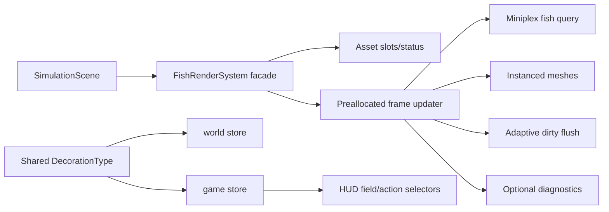

# Phase 7: Maintainability and project hygiene

## Status

Design approved by the owner: facade-preserving extraction (approach 1).

## Context

Issue #149 groups several low-risk quality improvements that have accumulated
around the renderer and project shell:

- `src/systems/FishRenderSystem.tsx` owns asset loading, optional-model
  fallback, pooled orientation state, instanced-mesh writes, adaptive flushing,
  cleanup, and diagnostics in one component.
- `DecorationType` is declared independently by the ECS store and the UI
  store.
- `HUD` subscribes to the complete Zustand store, so unrelated UI state can
  rerender the whole overlay.
- The README names removed modules, and the HTML shell still needs metadata and
  deployed-base-path hygiene.
- Browser smoke has reported asset/deprecation noise that must either be fixed
  locally or tracked against the responsible upstream dependency.

The simulation and renderer are already shipped and have strict performance
constraints: Rapier remains the physics source of truth, and the fish frame
path must not introduce per-frame allocations.

## Requirements (EARS)

1. **Renderer behavior** — WHEN fish assets, entities, or visual-quality flags
   change, THE SYSTEM SHALL preserve current loading, fallback, instance-cap,
   adaptive-flush, cleanup, and diagnostics behavior. Acceptance: existing
   fish renderer tests remain green and targeted extracted-module tests cover
   each moved responsibility.
2. **Hot-loop performance** — WHEN the fish `useFrame` callback runs, THE
   SYSTEM SHALL reuse its existing pools and scratch objects without adding
   allocations or changing the instance-update budget. Acceptance: static
   inspection plus the existing adaptive/performance tests and a production
   build pass.
3. **Domain type ownership** — WHEN store or decoration code refers to a
   decoration kind, THE SYSTEM SHALL import one shared `DecorationType` source
   of truth. Acceptance: no duplicate union declaration remains and all
   existing public imports continue to compile.
4. **Selective UI subscriptions** — WHEN unrelated game-store state changes,
   THE HUD SHALL remain mounted without rerendering its main component.
   Acceptance: a React render-count test changes an unrelated store field and
   observes no HUD render, while selected fields/actions still update the UI.
5. **Project hygiene** — WHEN the app is built, previewed, or smoke-tested,
   THE SYSTEM SHALL expose current documentation, metadata, favicon, and
   base-path-safe asset references with no stale module links, page errors, or
   404 responses. Acceptance: static hygiene tests, full build/bundle checks,
   and browser smoke pass; any unavoidable third-party warning is documented
   with an upstream reference and reproduction note.

## Non-goals

- Changing simulation rules, ECS schemas, physics ownership, fish materials, or
  WebGPU parity behavior.
- Rewriting the renderer around a new ECS render resource.
- Redesigning the mobile HUD delivered by Phase 6.
- Silencing browser warnings globally without identifying their source.

## Design

### Component boundaries

`FishRenderSystem` remains the public React component imported by
`SimulationScene` and existing tests. It becomes an orchestration facade with
stable refs and a single `useFrame` registration. Focused modules own the
details that do not need to be React components:

```text
FishRenderSystem facade
├── fishRenderAssets.tsx
│   ├── deferred variant Suspense slots
│   ├── optional-model timeout/error settlement
│   └── asset-status and model-availability callbacks
├── fishRenderPools.ts
│   ├── matrix/quaternion pool factories
│   └── pooled fish-orientation lifecycle helpers
├── fishRenderInstances.ts
│   ├── ECS query → model selection
│   ├── pooled transform and instanced-mesh writes
│   ├── stale-entity cleanup and cap warnings
│   └── adaptive dirty-matrix flushing
└── fishRenderDiagnostics.ts
    ├── optional timing/EMA sampling
    └── debug render-status publication/cleanup
```

The frame updater receives preallocated state and mesh/uniform refs created by
the facade. Its functions return small scalar results (counts/flags) and never
create arrays, Three.js objects, or closures inside the frame path. Existing
module-level scratch objects and the three model-specific pools remain owned by
that state. `fishRenderFlush.ts`, `fishModels.ts`, `FishModelMesh.tsx`, and
`instanceCapWarning.ts` keep their current contracts unless extraction makes a
type-only import clearer.

### Shared domain type

Add a small domain-types module (for example
`src/domain/types.ts`) containing `DecorationType`. `store.ts` re-exports the
type for compatibility, while `gameStore.ts`, `Decoration.tsx`, `HUD.tsx`, and
other consumers import the shared definition directly where practical. There
must be exactly one union declaration.

### HUD subscriptions

Replace the object destructuring call to `useGameStore()` with individual
selectors for `lastFedTime`, placement state, selected decoration, and each
action. Selectors must return primitives or stable action references; do not
introduce an allocating object selector. Existing interaction behavior and
keyboard shortcuts remain unchanged.

### Documentation and HTML shell

- Update the README system/module map to reference only files present in
  `src/`, including the current fixed-step scheduler and water/physics modules.
- Keep the favicon reference relative to the document so GitHub Pages base
  paths resolve it, and remove any stale `/vite.svg` source/reference.
- Add concise description, theme-color, Open Graph, and Twitter metadata to
  `index.html`; values describe the aquarium simulation and do not assume a
  root deployment path.
- Add `docs/agents/runtime-warnings.md` only if smoke reproduction leaves a
  third-party warning unresolved. Each entry records the exact warning,
  package/version, reproduction command, upstream issue or documentation link,
  and the condition for removal. Locally caused warnings are fixed and covered
  by smoke assertions instead.

### Data flow



## Interfaces and compatibility

- `FishRenderSystem` keeps its current no-props export and remains the only
  renderer component imported by `SimulationScene`.
- New render helpers use explicit state/context types rather than importing
  React state or the Zustand store.
- `DecorationType` remains type-only and is re-exported from `store.ts` to avoid
  breaking callers that currently import it there.
- No serialized save schema or runtime entity fields change.

## Error handling matrix

| Condition                             | Expected behavior                                                                                                         | Verification                          |
| ------------------------------------- | ------------------------------------------------------------------------------------------------------------------------- | ------------------------------------- |
| Primary GLTF fails                    | Preserve existing error boundary/fallback behavior and report a page error only if the app cannot render                  | loading/error tests + smoke           |
| Optional GLTF fails or times out      | Mark the variant settled, keep the primary model authoritative, and resolve requested model indices to an available model | loading tests + extracted asset tests |
| Geometry/material missing             | Use the existing fallback mesh and diagnostic message                                                                     | `FishModelMesh` tests                 |
| Per-model instance cap reached        | Skip overflow entries and emit the existing capped warning without interrupting frames                                    | cap test                              |
| Debug telemetry throws                | Swallow diagnostics failure so visuals continue                                                                           | diagnostics unit test                 |
| Stale README path or invalid metadata | Fail static hygiene test                                                                                                  | project hygiene test                  |
| 404/page error in browser             | Fail smoke test and fix the local reference before merge                                                                  | Playwright smoke                      |
| Third-party deprecation remains       | Track exact warning and upstream reference; do not suppress unrelated console output                                      | warning ledger + smoke evidence       |

## Test strategy

1. Add unit tests for pool/state helpers and the extracted instance updater,
   including model fallback, stale-entity release, caps, and adaptive flush
   result accounting.
2. Preserve and run all existing `FishRenderSystem.*` tests to catch Suspense,
   loading, lighting, and WebGL/WebGPU behavior regressions.
3. Add a HUD render-count regression test proving unrelated game-store updates
   do not rerender the component while selected fields still update.
4. Add static project-hygiene assertions for README paths, shared type
   ownership, and required HTML metadata; retain Playwright's no-page-error and
   no-404 checks.
5. Validate with the repository's full suite: format check, lint with zero
   warnings, typecheck, Vitest, production build, bundle budget, and Playwright
   smoke. Inspect the browser console for the known warning ledger.

## Rollout and review checkpoints

- Keep commits small and behavior-preserving: render extraction, shared type /
  selector changes, then docs/metadata and tests.
- Review the diff for accidental allocations in `useFrame`, duplicate type
  declarations, and changed public imports before opening the PR.
- The PR links this design, issue #149, and the validation matrix. Any warning
  that cannot be removed is called out explicitly rather than hidden.
