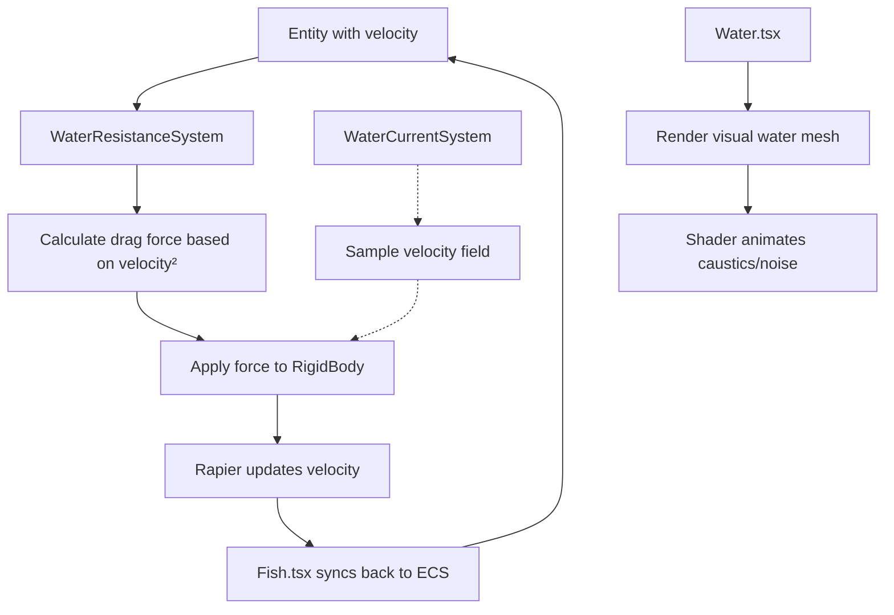

# [DES002] - Water Simulation (Hybrid Approach)

**Status:** Pending  
**Added:** 2025-12-09  
**Updated:** 2025-12-09

## Problem Statement

Currently, the aquarium tank has glass walls but no visual or physical representation of water. Fish move through empty space with no resistance or water-like behavior. We need to simulate water to:

1. Provide visual feedback that entities are underwater
2. Apply realistic drag/resistance forces to fish movement
3. Create ambient water effects (caustics, color, distortion)
4. Optionally support water currents and flow patterns

## Solution Overview

Implement a **hybrid water simulation** combining visual and physics approaches:

- **Phase 1**: Visual water mesh with shader effects
- **Phase 2**: Physics-based drag/resistance system
- **Phase 3**: Optional velocity field for currents

This approach balances realism, performance (60+ FPS target), and maintainability while staying true to the ECS architecture.

---

## Architecture

### Phase 1: Visual Water Mesh

#### Component: `Water.tsx`

**Purpose**: Render a transparent water volume inside the tank with realistic shader effects.

**Key Features**:

- Single box mesh filling tank interior (3.976m × 1.988m × 1.976m to stay inside glass walls)
- Custom shader material with:
  - **Color gradient**: Darker blue at bottom, lighter at top
  - **Caustics**: Animated light patterns on surfaces
  - **Fresnel effect**: Edge glow/transparency variation
  - **Noise distortion**: Subtle animated ripples
- No physics collider (water is non-blocking)
- Render order management to ensure proper transparency

**Integration**:

```tsx
// In App.tsx or Tank.tsx
<Tank />
<Water />
<Fish ... />
```

**Shader Inputs**:

```glsl
uniform float time;        // Animation
uniform vec3 waterColor;   // Base tint (#1a4d6d)
uniform float opacity;     // 0.85
uniform float causticsScale; // 2.0
uniform float causticsSpeed; // 0.5
```

---

### Phase 2: Water Resistance System

#### System: `WaterResistanceSystem.tsx`

**Purpose**: Apply drag forces to entities moving through water using Rapier physics.

**Physics Model**:

- **Quadratic drag**: F_drag = -0.5 × ρ × C_d × A × v²
  - ρ (rho): Water density (~1000 kg/m³, scaled to 1.0 for sim)
  - C_d: Drag coefficient (0.3 for streamlined fish)
  - A: Cross-sectional area (0.01 m² for average fish)
  - v: Current velocity vector

**Implementation**:

```typescript
// In useFrame loop
for (const entity of world.with('isFish', 'velocity', 'rigidBody')) {
  const speed = entity.velocity.length();
  const dragMagnitude = 0.5 * waterDensity * dragCoefficient * area * speed * speed;

  // Apply force opposite to velocity direction
  tempDragForce.copy(entity.velocity).normalize().multiplyScalar(-dragMagnitude);
  entity.rigidBody.addForce(tempDragForce, true);
}
```

**Configuration** (in `store.ts` or config):

```typescript
export const waterPhysics = {
  density: 1.0, // Relative to real water
  dragCoefficient: 0.3, // Fish streamlined shape
  crossSectionArea: 0.01, // m²
  buoyancyForce: 0.0, // Future: counteract gravity
};
```

**ECS Integration**:

- Query: `world.with('isFish', 'velocity')`
- Assumes `rigidBody` ref is accessible via entity or separate mapping
- Reuses temp vectors (module-level `tempDragForce = new Vector3()`)

---

### Phase 3: Velocity Field (Optional)

#### System: `WaterCurrentSystem.tsx` (Future)

**Purpose**: Create ambient water currents and flow patterns.

**Approach**:

- 3D grid of velocity vectors (e.g., 8×8×8 cells covering tank)
- Pre-computed patterns or procedurally generated (Perlin noise)
- Entities sample nearest cell and apply additional force
- Animated over time for organic feel

**Data Structure**:

```typescript
type VelocityGrid = {
  cells: Vector3[][][]; // [x][y][z] grid
  resolution: { x: number; y: number; z: number };
  bounds: Box3; // Tank extents
};
```

**Sampling**:

```typescript
function sampleVelocityField(position: Vector3, grid: VelocityGrid): Vector3 {
  // Convert world position to grid coordinates
  // Trilinear interpolation between 8 nearest cells
  // Return interpolated velocity vector
}
```

---

## Data Flow



**Note**: Dashed lines indicate Phase 3 (optional currents).

---

## Technical Specifications

### Tank Dimensions (from Tank.tsx)

- **Width**: 4m (X: -2 to +2)
- **Height**: 2m (Y: -1 to +1)
- **Depth**: 2m (Z: -1 to +1)
- **Wall Thickness**: 0.012m (glass)

### Water Volume

- **Interior Dimensions**: 3.976m × 1.988m × 1.976m
- **Position**: Centered at (0, 0, 0)

### Performance Budget

- **Target**: 60 FPS with 50-100 fish
- **Drag Calculation**: O(n) per frame where n = number of fish
- **Shader**: Fragment shader optimized with LOD
- **Velocity Field**: Optional, 512-1024 cells max

---

## Implementation Plan

### Phase 1: Visual Water (Priority: High)

**Files to Create**:

1. `src/components/Water.tsx` - React component
2. `src/shaders/waterShader.ts` - GLSL shader code

**Tasks**:

- [ ] Create Water component with box geometry
- [ ] Implement custom ShaderMaterial
- [ ] Add caustics pattern (simplex/Perlin noise)
- [ ] Add color gradient (depth-based)
- [ ] Add Fresnel transparency effect
- [ ] Animate with `useFrame` for time uniform
- [ ] Test transparency rendering order
- [ ] Integrate into App.tsx

**Acceptance Criteria**:

- Water volume fills tank interior
- Caustics animate smoothly
- No z-fighting or transparency issues
- Maintains 60 FPS with fish

---

### Phase 2: Water Resistance (Priority: High)

**Files to Create**:

1. `src/systems/WaterResistanceSystem.tsx` - ECS system
2. `src/config/waterPhysics.ts` - Configuration constants

**Files to Modify**:

1. `src/store.ts` - Add `rigidBody` ref to Entity type (if needed)
2. `src/components/Fish.tsx` - Ensure velocity is synced to ECS
3. `src/App.tsx` - Add WaterResistanceSystem

**Tasks**:

- [ ] Create WaterResistanceSystem component
- [ ] Implement quadratic drag calculation
- [ ] Add configuration for density, drag coefficient, area
- [ ] Query entities with `isFish` and `velocity`
- [ ] Apply forces via `rigidBody.addForce()`
- [ ] Use module-level temp vectors (no allocations in loop)
- [ ] Test with various fish speeds
- [ ] Tune coefficients for realistic movement

**Acceptance Criteria**:

- Fish experience velocity-dependent drag
- Faster fish slow down more quickly
- Movement feels "underwater"
- No performance degradation
- No `new Vector3()` in render loop

---

### Phase 3: Velocity Field (Priority: Low - Future)

**Files to Create**:

1. `src/systems/WaterCurrentSystem.tsx` - ECS system
2. `src/utils/velocityField.ts` - Grid utilities

**Tasks**:

- [ ] Design grid resolution (8×8×8 or similar)
- [ ] Implement trilinear interpolation sampling
- [ ] Create procedural flow pattern (Perlin noise)
- [ ] Add time-based animation
- [ ] Apply sampled velocity as force
- [ ] Add visualization helper (optional debug mode)
- [ ] Performance test with grid

**Acceptance Criteria**:

- Fish drift with currents
- Currents animate organically
- Maintains 60 FPS target
- Grid resolution is tunable

---

## Testing Strategy

### Visual Tests

- [ ] Water mesh renders inside tank bounds
- [ ] Caustics are visible and animate
- [ ] Transparency blends correctly with glass walls
- [ ] Color gradient is visible from top to bottom
- [ ] No flickering or z-fighting

### Physics Tests

- [ ] Fast-moving fish slow down due to drag
- [ ] Stationary fish remain stationary (no spurious forces)
- [ ] Drag force scales with velocity squared
- [ ] Multiple fish experience consistent drag
- [ ] Performance remains at 60 FPS with 100 fish

### Integration Tests

- [ ] Water + Fish + Boids systems work together
- [ ] No conflicts with existing systems
- [ ] Memory usage remains stable
- [ ] No object allocations in render loop

---

## Known Constraints

1. **Performance**: Must maintain 60+ FPS target
   - Shader complexity limited by fragment count
   - Drag calculations are O(n) per frame
2. **Physics**: Rapier is source of truth
   - Cannot manually modify `entity.position`
   - All forces must go through `RigidBody` API
3. **Rendering**: Transparency is tricky
   - Render order matters for glass + water
   - May need manual depth sorting
4. **Vector Allocation**: Zero allocations in loops
   - Use module-level temp vectors
   - Reuse Vector3 instances

---

## Future Enhancements

- **Buoyancy**: Upward force to counteract gravity
- **Surface waves**: Ripple effect at top boundary
- **Underwater particles**: Floating debris, bubbles
- **Light rays**: Volumetric god rays through water
- **Temperature layers**: Thermocline with different densities
- **Interactive currents**: User-controlled flow direction

---

## Decision Records

### DR-001: Why Hybrid Approach?

**Context**: Need both visual and physical water simulation.  
**Decision**: Separate visual (shader) and physics (drag system) concerns.  
**Rationale**:

- Decoupling allows independent optimization
- Shader can be complex without affecting physics
- Physics can be tuned without re-rendering
- Aligns with ECS separation of concerns

**Alternatives Considered**:

- Full SPH fluid simulation (too expensive)
- Pure visual with no physics (unrealistic movement)

---

### DR-002: Why Quadratic Drag Formula?

**Context**: Multiple drag models available (linear, quadratic, turbulent).  
**Decision**: Use quadratic drag (F ∝ v²).  
**Rationale**:

- Realistic for Reynolds numbers in fish swimming (Re > 1000)
- Prevents unrealistic acceleration at high speeds
- Standard in game physics engines

**Alternatives Considered**:

- Linear drag (F ∝ v): Too simple, unrealistic
- Turbulent drag (F ∝ v³): Overkill for this simulation

---

### DR-003: Water as Non-Colliding Volume

**Context**: Should water block movement?  
**Decision**: Water has no collider, only visual + force fields.  
**Rationale**:

- Fish should move through water, not bounce off it
- Tank walls provide containment
- Drag forces provide resistance without collision

**Alternatives Considered**:

- Colliding water volume (unnecessary complexity)

---

## References

- [Rapier Physics Docs](https://rapier.rs/docs/)
- [Three.js ShaderMaterial](https://threejs.org/docs/#api/en/materials/ShaderMaterial)
- [Fish Swimming Hydrodynamics](https://en.wikipedia.org/wiki/Aquatic_locomotion)
- [Drag Equation](https://en.wikipedia.org/wiki/Drag_equation)
